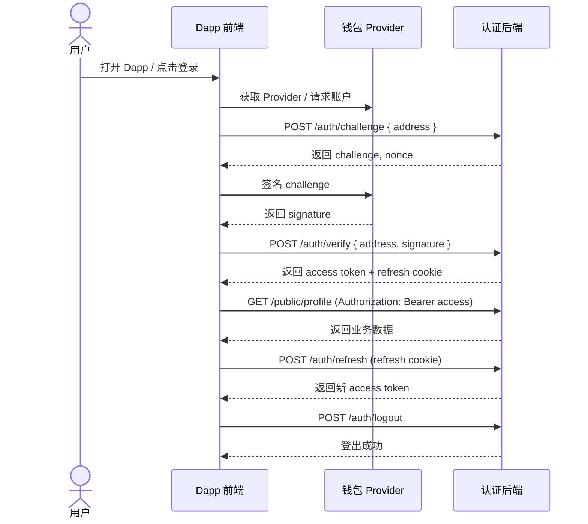
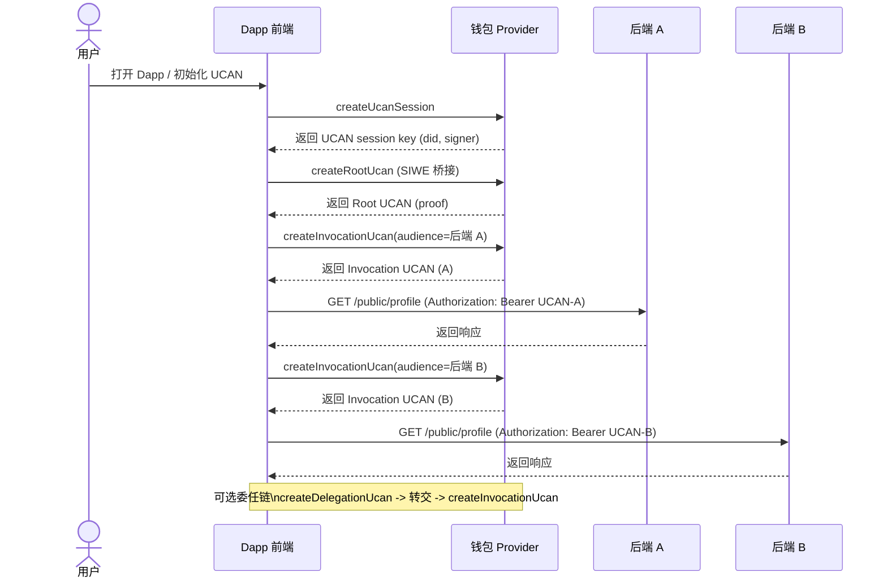

# YeYing Inject Wallet SDK

轻量级注入钱包 SDK，专注浏览器端 EIP-1193 Provider。默认优先选择 YeYing Wallet（支持 EIP-6963 多钱包发现）。
仅支持浏览器环境（依赖 `window` / `localStorage` / `fetch`）。

## 安装

```bash
npm install @yeying-community/web3-bs
```

## Dapp 集成（浏览器）

SDK 仅支持浏览器环境。推荐两种接入方式：

### 方式一：模块化（打包器 / Vite / Webpack）

```ts
import { getProvider, loginWithChallenge, authFetch } from '@yeying-community/web3-bs';

const provider = await getProvider({ timeoutMs: 3000 });
const login = await loginWithChallenge({
  provider,
  baseUrl: 'http://localhost:3203/api/v1/public/auth',
  storeToken: false,
});

const res = await authFetch('http://localhost:3203/api/v1/public/profile', { method: 'GET' }, {
  baseUrl: 'http://localhost:3203/api/v1/public/auth',
  storeToken: false,
});
console.log(await res.json());
```

### 方式二：UMD（纯 HTML）

```html
<script src="https://your-host/dist/web3-bs.umd.js"></script>
<script>
  const { getProvider, loginWithChallenge } = window.YeYingWeb3;
  async function login() {
    const provider = await getProvider({ timeoutMs: 3000 });
    const result = await loginWithChallenge({
      provider,
      baseUrl: 'http://localhost:3203/api/v1/public/auth',
      storeToken: false,
    });
    console.log(result);
  }
  login();
</script>
```

提示：UMD 模式下全局对象为 `window.YeYingWeb3`，需要保证 `dist/web3-bs.umd.js` 可访问。

## SIWE 登录（不使用 UCAN）

如果只需要传统 SIWE + JWT 登录（单后端），可以不启用 UCAN：

```ts
import { getProvider, loginWithChallenge, authFetch, refreshAccessToken, logout } from '@yeying-community/web3-bs';

const provider = await getProvider();
const login = await loginWithChallenge({
  provider,
  baseUrl: 'http://localhost:3203/api/v1/public/auth',
  storeToken: false,
});

const profile = await authFetch('http://localhost:3203/api/v1/public/profile', { method: 'GET' }, {
  baseUrl: 'http://localhost:3203/api/v1/public/auth',
  storeToken: false,
});
console.log(await profile.json());

await refreshAccessToken({ baseUrl: 'http://localhost:3203/api/v1/public/auth', storeToken: false });
await logout({ baseUrl: 'http://localhost:3203/api/v1/public/auth', storeToken: false });
```

## SIWE 与 UCAN 完整登录流程

### SIWE vs UCAN 对比（token 来源 / 有效期 / 续期方式）

| 维度 | SIWE 登录（JWT） | UCAN 授权 |
| --- | --- | --- |
| Token 来源 | 后端签发 access token + refresh cookie | 前端生成 UCAN（Root/Invocation），后端只校验 |
| 有效期 | access/refresh 由后端配置 | Invocation 默认 5 分钟，Root 默认 24 小时（可配置） |
| 续期方式 | `POST /auth/refresh`（refresh cookie） | 重新生成 Invocation；Root 过期则重新生成 Root + Invocation |

### SIWE-only（单后端）
1. 前端检测钱包 Provider（`getProvider` / `requestAccounts`）。
2. 请求后端 challenge：`POST /api/v1/public/auth/challenge`。
3. 钱包签名 challenge（`personal_sign`）。
4. 提交签名到后端：`POST /api/v1/public/auth/verify`，获取 access token + refresh cookie。
5. 访问业务接口：`Authorization: Bearer <access-token>`（`authFetch` 会自动附带）。
6. access 过期时刷新：`POST /api/v1/public/auth/refresh`（依赖 httpOnly refresh cookie）。
7. 退出登录：`POST /api/v1/public/auth/logout`。

Mermaid：



### UCAN（多后端 / Delegation）
1. 前端检测钱包 Provider（`getProvider` / `requestAccounts`）。
2. 由钱包生成 UCAN Session Key：`createUcanSession`。
3. 用 SIWE 作为桥梁生成 Root UCAN（包含能力 `[{ resource, action }]`）：`createRootUcan` 或 `getOrCreateUcanRoot`。
4. 针对每个后端生成 Invocation UCAN：`createInvocationUcan({ issuer: session, audience, capabilities, proofs: [root] })`。
5. 调用后端业务接口：`Authorization: Bearer <UCAN>`（可用 `authUcanFetch`）。
6. 如需可转授权，先生成 Delegation UCAN：`createDelegationUcan`，由被委任方再生成 Invocation UCAN。
7. Root/Invocation 过期时重新生成（或由 `initWebDavStorage` 自动处理）。
提示：Root 过期后前端应重新授权并重试（重新生成 Root + Invocation）。

推荐重试逻辑示例：
```ts
import { getOrCreateUcanRoot, createInvocationUcan } from '@yeying-community/web3-bs';

async function callWithUcanRetry(target, caps, provider, session) {
  const root = await getOrCreateUcanRoot({ provider, session, capabilities: caps });
  let token = await createInvocationUcan({
    issuer: session,
    audience: target.aud,
    capabilities: caps,
    proofs: [root],
  });

  let res = await fetch(target.url, {
    headers: { Authorization: `Bearer ${token}` },
  });
  if (res.status !== 401) return res;

  // Root 过期：重新生成 Root 并重试一次
  const newRoot = await getOrCreateUcanRoot({ provider, session, capabilities: caps, expiresInMs: 24 * 60 * 60 * 1000 });
  token = await createInvocationUcan({
    issuer: session,
    audience: target.aud,
    capabilities: caps,
    proofs: [newRoot],
  });
  return await fetch(target.url, {
    headers: { Authorization: `Bearer ${token}` },
  });
}
```

Mermaid：



## 钱包交互 API

### Provider 发现
- `getProvider(options?)`
  - 自动监听 `eip6963:announceProvider`
  - 默认优先 YeYing（`isYeYing` 或 `rdns: io.github.yeying`）

### 核心方法
- `requestAccounts({ provider? })`
- `getAccounts(provider?)`
- `getChainId(provider?)`
- `getBalance(provider?, address?, blockTag?)`
- `signMessage({ provider?, message, address?, method? })`
  - `method` 默认 `personal_sign`

### 事件
- `onAccountsChanged(provider, handler)`
- `onChainChanged(provider, handler)`

## 后端交互 API（推荐标准）
OpenAPI 规范：`docs/openapi.yaml`

### 响应封装（严格）
所有响应必须使用以下封装结构：

```json
{
  "code": 0,
  "message": "ok",
  "data": { "...": "..." },
  "timestamp": 1730000000000
}
```

- `code = 0` 表示成功
- `code != 0` 表示失败；`data` 应为 `null`

### 1) 获取 Challenge

`POST /api/v1/public/auth/challenge`

请求
```json
{ "address": "0xabc123..." }
```

响应
```json
{
  "code": 0,
  "message": "ok",
  "data": {
    "address": "0xabc123...",
    "challenge": "Sign to login...",
    "nonce": "random",
    "issuedAt": 1730000000000,
    "expiresAt": 1730000300000
  },
  "timestamp": 1730000000000
}
```

### 2) 验证签名

`POST /api/v1/public/auth/verify`

请求
```json
{ "address": "0xabc123...", "signature": "0x..." }
```

响应
```json
{
  "code": 0,
  "message": "ok",
  "data": {
    "address": "0xabc123...",
    "token": "access-token",
    "expiresAt": 1730086400000,
    "refreshExpiresAt": 1730686400000
  },
  "timestamp": 1730000000000
}
```

说明
- `verify` 应设置 httpOnly 的 `refresh_token` Cookie（用于刷新 access token）。
- 访问受保护接口时，前端使用 `Authorization: Bearer <access-token>`。

### 3) 刷新 Access Token

`POST /api/v1/public/auth/refresh`

请求
- 依赖 httpOnly `refresh_token` Cookie

响应
```json
{
  "code": 0,
  "message": "ok",
  "data": {
    "address": "0xabc123...",
    "token": "new-access-token",
    "expiresAt": 1730086400000,
    "refreshExpiresAt": 1730686400000
  },
  "timestamp": 1730000000000
}
```

### 4) 退出登录

`POST /api/v1/public/auth/logout`

响应
```json
{
  "code": 0,
  "message": "ok",
  "data": { "logout": true },
  "timestamp": 1730000000000
}
```

### SDK 绑定
- `loginWithChallenge` 会从 `data.challenge` 读取 challenge，从 `data.token` 读取 token。
- `refreshAccessToken` 调用 `/refresh` 并更新 access token（默认 `credentials: 'include'`）。
- `authFetch` 会自动携带 access token，遇到 401 会尝试刷新再重试一次。
- `logout` 会清理刷新 Cookie 并清空本地 access token（若设置 `storeToken`）。

## 示例

- Frontend Dapp (HTML): `examples/frontend/dapp.html`
- Frontend Dapp (TS module): `examples/frontend/main.ts`
- Backend server (Node): `examples/backend/node/server.js`
- Backend server (Go): `examples/backend/go/main.go`
- Backend server (Python): `examples/backend/python/app.py`
- Backend server (Java): `examples/backend/java/src/main/java/com/yeying/demo/AuthServer.java`

## UCAN 授权（SIWE Bridge）

SDK 通过 YeYing 钱包生成 UCAN Session Key 并完成签名（由钱包后台隔离私钥）。
Root UCAN 基于 SIWE 签名，
用于多后端统一鉴权。UCAN 以 `Authorization: Bearer <UCAN>` 发送，后端会验证 UCAN 证明链与能力。

新增 API：
- `createUcanSession(options?)`
- `createRootUcan(options)`
- `createDelegationUcan(options)`
- `createInvocationUcan(options)`
- `authUcanFetch(url, init?, options?)`

示例：
```ts
const session = await createUcanSession();
const root = await createRootUcan({
  provider,
  session,
  capabilities: [{ resource: 'profile', action: 'read' }],
});

const ucan = await createInvocationUcan({
  issuer: session,
  audience: 'did:web:localhost:3203',
  capabilities: [{ resource: 'profile', action: 'read' }],
  proofs: [root],
});

const res = await authUcanFetch('http://localhost:3203/api/v1/public/profile', { method: 'GET' }, { ucan });
console.log(await res.json());
```

后端默认要求的能力为 `resource=profile`、`action=read`，可通过环境变量覆盖：
- `UCAN_AUD`：服务 DID（默认 `did:web:localhost:3203`）
- `UCAN_RESOURCE`：资源（默认 `profile`）
- `UCAN_ACTION`：动作（默认 `read`）

提示：如需可转授权，使用 `createDelegationUcan` 创建委任链，再用被委任的 Key 生成 Invocation UCAN。

## WebDAV 存储（Storage）

提供基于 WebDAV 服务的文件操作封装（上传/下载/删除/目录等），适配 `webdav` 项目 API。

新增便捷能力：
- `initWebDavStorage`：自动生成/复用 UCAN Invocation Token，并可在首次使用时创建应用目录
- `ensureDirectory(path)`：递归创建目录（存在时自动跳过）

示例：
```ts
import { createWebDavClient, initWebDavStorage, loginWithChallenge } from '@yeying-community/web3-bs';

const login = await loginWithChallenge({
  provider,
  baseUrl: 'http://localhost:6065/api/v1/public/auth',
  storeToken: false,
});

const client = createWebDavClient({
  baseUrl: 'http://localhost:6065',
  token: login.token,
  prefix: '/',
});

const listingXml = await client.listDirectory('/');
await client.upload('/docs/hello.txt', 'Hello WebDAV');
const content = await client.downloadText('/docs/hello.txt');

// UCAN 登录 + 自动创建应用目录（推荐）
const storage = await initWebDavStorage({
  baseUrl: 'http://localhost:6065',
  audience: 'did:web:localhost:6065',
  appId: 'my-dapp',
  capabilities: [{ resource: 'profile', action: 'read' }],
});
await storage.client.upload(`${storage.appDir}/hello.txt`, 'Hello WebDAV');
```

常用方法：
- `listDirectory(path?, depth?)`（PROPFIND，返回 XML 文本）
- `upload(path, content, contentType?)`
- `download(path)` / `downloadText(path)` / `downloadArrayBuffer(path)`
- `createDirectory(path)`（MKCOL）
- `ensureDirectory(path)`（递归 MKCOL，已存在会跳过）
- `remove(path)`（DELETE）
- `move(path, destination, overwrite?)`
- `copy(path, destination, overwrite?)`
- `getQuota()` / `listRecycle()` / `recoverRecycle(hash)` / `deleteRecycle(hash)` / `clearRecycle()`

提示：`capabilities` 需与 WebDAV 后端 UCAN 策略一致；`appId` 默认映射为 `/apps/<appId>`。

## Dapp 快速接入（推荐）

一次完成 SIWE 登录 + UCAN WebDAV 初始化 + 创建应用目录：

```ts
import { initDappSession } from '@yeying-community/web3-bs';

const session = await initDappSession({
  appAuth: {
    baseUrl: 'http://localhost:3203/api/v1/public/auth',
    storeToken: false,
  },
  webdav: {
    baseUrl: 'http://localhost:6065',
    audience: 'did:web:localhost:6065',
    appId: 'my-dapp',
    capabilities: [{ resource: 'profile', action: 'read' }],
  },
});

const webdav = session.webdavClient;
await webdav?.upload(`${session.webdavAppDir}/hello.txt`, 'Hello WebDAV');
```

## 本地验证

1. 构建 SDK：`npm run build`
2. 启动后端：`node examples/backend/node/server.js`
3. 启动前端：`python3 -m http.server 8001`
4. 访问：`http://localhost:8001/examples/frontend/dapp.html`
5. 确保安装 YeYing 钱包扩展插件
6. 点击：`Detect Provider` → `Connect Wallet` → `Login`

提示：如果前端来自其他域名，请设置
`COOKIE_SAMESITE=none` 且 `COOKIE_SECURE=true` 并使用 HTTPS，
以便 `refresh_token` Cookie 能随 `credentials: 'include'` 发送。

## 多后端联调（不同端口）

可同时启动多语言后端（不同端口），验证 UCAN 多后端授权：

```bash
./scripts/backend.sh start all
./scripts/backend.sh start all --setup
```

默认端口：
- Go `3201`
- Java `3202`
- Node `3203`
- Python `3204`

前端调用不同端口的后端时：
- 将前端 Origin 加入 `CORS_ORIGINS`（例如 `http://localhost:3203`）
- UCAN 调用的 `audience` 与后端 `UCAN_AUD` 一致（如 `did:web:localhost:3202`）

提示：`examples/frontend/dapp.html` 已内置多后端列表，可在一次 UCAN 授权后依次调用多个服务。

## 常见问题

### 刷新token失败

清理旧 Cookie 后重新登录：在浏览器 DevTools → Application → Cookies → http://localhost:8001 删除 refresh_token，再点 Login 后再点 Refresh Token。
