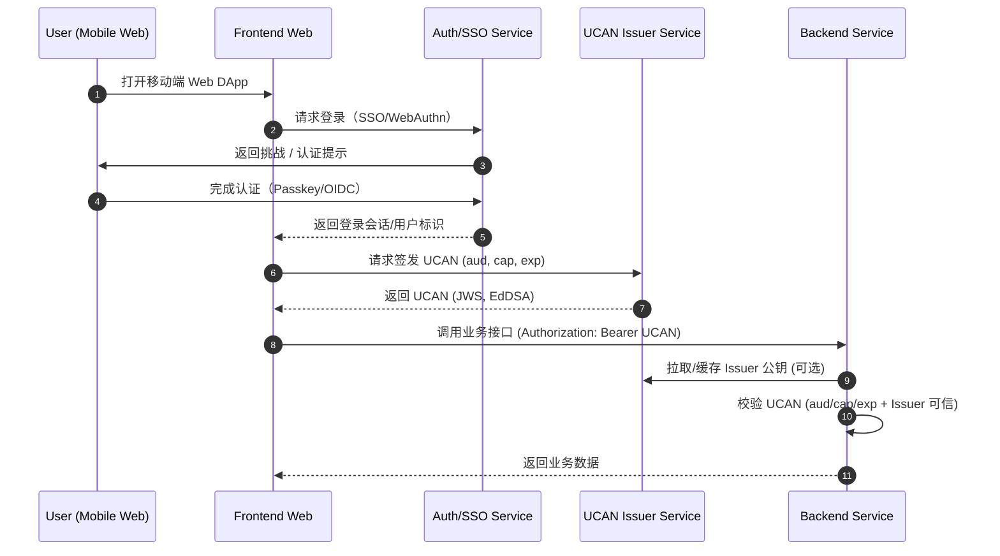

# 方案 D：中心化 UCAN 发行服务（服务端签 UCAN）

## 1. 适用场景

- 希望保留“UCAN 形态”
- 可以接受中心化信任（非链上身份）

## 2. 核心思路

使用 SSO/WebAuthn 登录后，由 **Issuer 服务** 生成 UCAN（JWS EdDSA），后端改为信任该 Issuer。

## 3. 详细落地流程

## 3.1 序列图（中心化 UCAN 发行）

1) 用户用 SSO/WebAuthn 登录
2) Issuer 服务签发 UCAN：
   - `iss` 为 Issuer DID
   - `aud` 指向后端服务
   - `cap` 由后端策略决定（如 `app:<appId>`）
3) 前端携带 `Authorization: Bearer <UCAN>`
4) 后端验证：改为信任 Issuer 公钥（非钱包）

## 4. 后端改造清单

- UCAN 验签逻辑改为信任 Issuer DID（而非用户钱包）
- 不再要求 SIWE Root Proof
- 改变信任模型（需要安全审计）

## 5. 优缺点

- **优点**：仍可用 UCAN 形式在多后端分发
- **缺点**：不再是用户控制的 UCAN；安全语义改变

## 6. 结论

可行但会改变 UCAN 信任模型，需谨慎评估。
