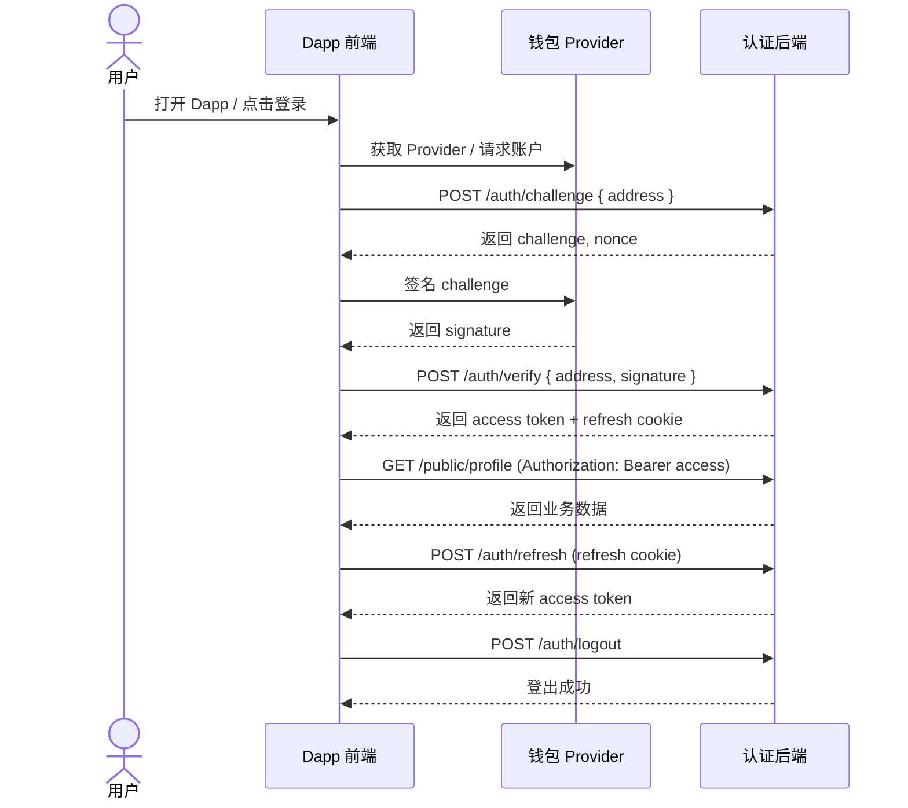
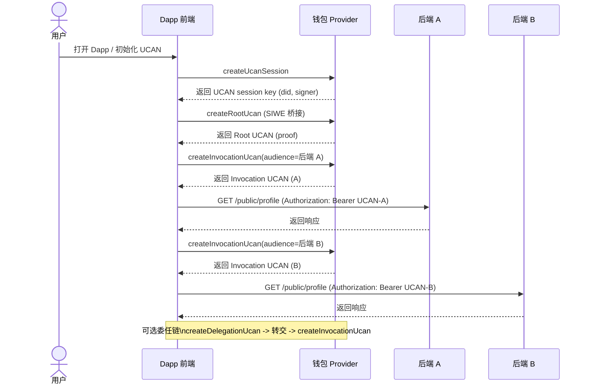

# SDK 能力与账户管理设计

本文档集中整理 Dapp 接入方式、SIWE/UCAN 登录流程、钱包交互 API、UCAN 授权、WebDAV 存储与快速接入示例，作为 README 的扩展说明。

## 目录

- [1. SDK 能力概览](#1-sdk-能力概览)
- [2. 账户使用场景设计](#2-账户使用场景设计)
- [3. 账户选择策略](#3-账户选择策略)
- [4. 设计要点](#4-设计要点)
- [5. Dapp 集成（浏览器）](#5-dapp-集成浏览器)
- [6. SIWE 与 UCAN 完整登录流程](#6-siwe-与-ucan-完整登录流程)
- [7. 后端交互 API（推荐标准）](#7-后端交互-api推荐标准)
- [8. 钱包交互 API](#8-钱包交互-api)
- [9. WebDAV 存储（Storage）](#9-webdav-存储storage)
- [10. Dapp 快速接入（推荐）](#10-dapp-快速接入推荐)

## 1. SDK 能力概览

当前 SDK 面向浏览器环境，主要能力如下：

- Provider 发现与选择（EIP-6963 / EIP-1193）
- 账户/链/余额读取与事件监听
- SIWE 登录（challenge/verify/refresh/logout）
- UCAN 授权（Session / Root / Delegation / Invocation）
- WebDAV 存储能力（基于 UCAN token）
- Dapp 快速初始化（`initDappSession`）

## 2. 账户使用场景设计

### 2.1 使用“之前连接的账户”

钱包会记录“已授权账户”，Dapp 不需要每次都弹出授权弹窗。
在页面初始化阶段，可以先读取已授权账户（`eth_accounts`）：

```ts
import { getProvider, getPreferredAccount } from '@yeying-community/web3-bs';

const provider = await getProvider({ timeoutMs: 3000 });
const { account, accounts } = await getPreferredAccount({
  provider,
  autoConnect: false,
});

if (!account) {
  // 用户尚未授权，可提示点击“Connect Wallet”
}
```

### 2.2 首次连接或主动授权

当用户主动点击“Connect Wallet”，再触发授权弹窗：

```ts
const { account } = await getPreferredAccount({
  provider,
  autoConnect: true,
});
```

### 2.3 账户切换感知与更新

钱包账户发生变化时，需要更新 Dapp 的登录态与业务状态：

```ts
import { watchAccounts, clearAccessToken, clearUcanSession } from '@yeying-community/web3-bs';

const unsubscribe = watchAccounts(provider, ({ account, accounts }) => {
  // UI 刷新
  console.log('accountsChanged', account, accounts);

  // 登录态建议清理并重新走授权
  clearAccessToken({ storeToken: false });
  clearUcanSession();
  // 重新发起 SIWE / UCAN 登录流程
});

// 页面销毁时：unsubscribe();
```

## 3. 账户选择策略

SDK 提供“优先使用上次选择账户”的策略：

- `getPreferredAccount()` 会在本地缓存上次选择的账户
- 若该账户仍在 `eth_accounts` 返回列表中，则优先使用
- 否则回退到 `accounts[0]`

相关配置：

- `storageKey`：自定义本地缓存 key（默认 `yeying:last_account`）
- `preferStored`：是否优先使用缓存账户（默认 true）
- `autoConnect`：若未授权账户，是否自动发起授权请求

## 4. 设计要点

- “已授权账户”由钱包决定；Dapp 只读取 `eth_accounts`
- `eth_requestAccounts` 会触发用户授权弹窗，仅在用户主动操作时调用
- 账户切换后，应清理 SIWE token 与 UCAN Root，并重新登录

## 5. Dapp 集成（浏览器）

SDK 仅支持浏览器环境。推荐两种接入方式：

### 5.1 模块化（打包器 / Vite / Webpack）

```ts
import { getProvider, loginWithChallenge, authFetch } from '@yeying-community/web3-bs';

const provider = await getProvider({ timeoutMs: 3000 });
const login = await loginWithChallenge({
  provider,
  baseUrl: 'http://127.0.0.1:3203/api/v1/public/auth',
  storeToken: false,
});

const res = await authFetch('http://127.0.0.1:3203/api/v1/public/profile', { method: 'GET' }, {
  baseUrl: 'http://127.0.0.1:3203/api/v1/public/auth',
  storeToken: false,
});
console.log(await res.json());
```

### 5.2 UMD（纯 HTML）

```html
<script src="https://your-host/dist/web3-bs.umd.js"></script>
<script>
  const { getProvider, loginWithChallenge } = window.YeYingWeb3;
  async function login() {
    const provider = await getProvider({ timeoutMs: 3000 });
    const result = await loginWithChallenge({
      provider,
      baseUrl: 'http://127.0.0.1:3203/api/v1/public/auth',
      storeToken: false,
    });
    console.log(result);
  }
  login();
</script>
```

提示：UMD 模式下全局对象为 `window.YeYingWeb3`，需要保证 `dist/web3-bs.umd.js` 可访问。

## 6. SIWE 与 UCAN 完整登录流程

### 6.1 SIWE 登录（不使用 UCAN）

如果只需要传统 SIWE + JWT 登录（单后端），可以不启用 UCAN：

```ts
import { getProvider, loginWithChallenge, authFetch, refreshAccessToken, logout } from '@yeying-community/web3-bs';

const provider = await getProvider();
const login = await loginWithChallenge({
  provider,
  baseUrl: 'http://127.0.0.1:3203/api/v1/public/auth',
  storeToken: false,
});

const profile = await authFetch('http://127.0.0.1:3203/api/v1/public/profile', { method: 'GET' }, {
  baseUrl: 'http://127.0.0.1:3203/api/v1/public/auth',
  storeToken: false,
});
console.log(await profile.json());

await refreshAccessToken({ baseUrl: 'http://127.0.0.1:3203/api/v1/public/auth', storeToken: false });
await logout({ baseUrl: 'http://127.0.0.1:3203/api/v1/public/auth', storeToken: false });
```

### 6.2 SIWE vs UCAN 对比（token 来源 / 有效期 / 续期方式）

| 维度 | SIWE 登录（JWT） | UCAN 授权 |
| --- | --- | --- |
| Token 来源 | 后端签发 access token + refresh cookie | 前端生成 UCAN（Root/Invocation），后端只校验 |
| 有效期 | access/refresh 由后端配置 | Invocation 默认 5 分钟，Root 默认 24 小时（可配置） |
| 续期方式 | `POST /auth/refresh`（refresh cookie） | 重新生成 Invocation；Root 过期则重新生成 Root + Invocation |

### 6.3 SIWE-only（单后端）

1. 前端检测钱包 Provider（`getProvider` / `requestAccounts`）。
2. 请求后端 challenge：`POST /api/v1/public/auth/challenge`。
3. 钱包签名 challenge（`personal_sign`）。
4. 提交签名到后端：`POST /api/v1/public/auth/verify`，获取 access token + refresh cookie。
5. 访问业务接口：`Authorization: Bearer <access-token>`（`authFetch` 会自动附带）。
6. access 过期时刷新：`POST /api/v1/public/auth/refresh`（依赖 httpOnly refresh cookie）。
7. 退出登录：`POST /api/v1/public/auth/logout`。

Mermaid：



### 6.4 UCAN（多后端 / Delegation）

1. 前端检测钱包 Provider（`getProvider` / `requestAccounts`）。
2. 由钱包生成 UCAN Session Key：`createUcanSession`。
3. 用 SIWE 作为桥梁生成 Root UCAN（包含能力 `[{ resource, action }]`）：`createRootUcan` 或 `getOrCreateUcanRoot`。
4. 针对每个后端生成 Invocation UCAN：`createInvocationUcan({ issuer: session, audience, capabilities, proofs: [root] })`。
5. 调用后端业务接口：`Authorization: Bearer <UCAN>`（可用 `authUcanFetch`）。
6. 如需可转授权，先生成 Delegation UCAN：`createDelegationUcan`，由被委任方再生成 Invocation UCAN。
7. Root/Invocation 过期时重新生成（或由 `initWebDavStorage` 自动处理）。

提示：Root 过期后前端应重新授权并重试（重新生成 Root + Invocation）。

推荐重试逻辑示例：
```ts
import { getOrCreateUcanRoot, createInvocationUcan } from '@yeying-community/web3-bs';

async function callWithUcanRetry(target, caps, provider, session) {
  const root = await getOrCreateUcanRoot({ provider, session, capabilities: caps });
  let token = await createInvocationUcan({
    issuer: session,
    audience: target.aud,
    capabilities: caps,
    proofs: [root],
  });

  let res = await fetch(target.url, {
    headers: { Authorization: `Bearer ${token}` },
  });
  if (res.status !== 401) return res;

  // Root 过期：重新生成 Root 并重试一次
  const newRoot = await getOrCreateUcanRoot({ provider, session, capabilities: caps, expiresInMs: 24 * 60 * 60 * 1000 });
  token = await createInvocationUcan({
    issuer: session,
    audience: target.aud,
    capabilities: caps,
    proofs: [newRoot],
  });
  return await fetch(target.url, {
    headers: { Authorization: `Bearer ${token}` },
  });
}
```

Mermaid：



### 6.5 UCAN 授权 API（SIWE Bridge）

SDK 通过 YeYing 钱包生成 UCAN Session Key 并完成签名（由钱包后台隔离私钥）。
Root UCAN 基于 SIWE 签名，用于多后端统一鉴权。UCAN 以 `Authorization: Bearer <UCAN>` 发送，后端会验证 UCAN 证明链与能力。

新增 API：
- `createUcanSession(options?)`
- `createRootUcan(options)`
- `createDelegationUcan(options)`
- `createInvocationUcan(options)`
- `authUcanFetch(url, init?, options?)`

示例：
```ts
const session = await createUcanSession();
const root = await createRootUcan({
  provider,
  session,
  capabilities: [{ resource: 'profile', action: 'read' }],
});

const ucan = await createInvocationUcan({
  issuer: session,
  audience: 'did:web:127.0.0.1:3203',
  capabilities: [{ resource: 'profile', action: 'read' }],
  proofs: [root],
});

const res = await authUcanFetch('http://127.0.0.1:3203/api/v1/public/profile', { method: 'GET' }, { ucan });
console.log(await res.json());
```

后端默认要求的能力为 `resource=profile`、`action=read`，可通过环境变量覆盖：
- `UCAN_AUD`：服务 DID（默认 `did:web:127.0.0.1:3203`）
- `UCAN_RESOURCE`：资源（默认 `profile`）
- `UCAN_ACTION`：动作（默认 `read`）

提示：如需可转授权，使用 `createDelegationUcan` 创建委任链，再用被委任的 Key 生成 Invocation UCAN。

## 7. 后端交互 API（推荐标准）

OpenAPI 规范：`docs/openapi.yaml`

### 7.1 响应封装（严格）

所有响应必须使用以下封装结构：

```json
{
  "code": 0,
  "message": "ok",
  "data": { "...": "..." },
  "timestamp": 1730000000000
}
```

- `code = 0` 表示成功
- `code != 0` 表示失败；`data` 应为 `null`

### 7.2 获取 Challenge

`POST /api/v1/public/auth/challenge`

请求
```json
{ "address": "0xabc123..." }
```

响应
```json
{
  "code": 0,
  "message": "ok",
  "data": {
    "address": "0xabc123...",
    "challenge": "Sign to login...",
    "nonce": "random",
    "issuedAt": 1730000000000,
    "expiresAt": 1730000300000
  },
  "timestamp": 1730000000000
}
```

### 7.3 验证签名

`POST /api/v1/public/auth/verify`

请求
```json
{ "address": "0xabc123...", "signature": "0x..." }
```

响应
```json
{
  "code": 0,
  "message": "ok",
  "data": {
    "address": "0xabc123...",
    "token": "access-token",
    "expiresAt": 1730086400000,
    "refreshExpiresAt": 1730686400000
  },
  "timestamp": 1730000000000
}
```

说明
- `verify` 应设置 httpOnly 的 `refresh_token` Cookie（用于刷新 access token）。
- 访问受保护接口时，前端使用 `Authorization: Bearer <access-token>`。

### 7.4 刷新 Access Token

`POST /api/v1/public/auth/refresh`

请求
- 依赖 httpOnly `refresh_token` Cookie

响应
```json
{
  "code": 0,
  "message": "ok",
  "data": {
    "address": "0xabc123...",
    "token": "new-access-token",
    "expiresAt": 1730086400000,
    "refreshExpiresAt": 1730686400000
  },
  "timestamp": 1730000000000
}
```

### 7.5 退出登录

`POST /api/v1/public/auth/logout`

响应
```json
{
  "code": 0,
  "message": "ok",
  "data": { "logout": true },
  "timestamp": 1730000000000
}
```

### 7.6 SDK 绑定

- `loginWithChallenge` 会从 `data.challenge` 读取 challenge，从 `data.token` 读取 token。
- `refreshAccessToken` 调用 `/refresh` 并更新 access token（默认 `credentials: 'include'`）。
- `authFetch` 会自动携带 access token，遇到 401 会尝试刷新再重试一次。
- `logout` 会清理刷新 Cookie 并清空本地 access token（若设置 `storeToken`）。

## 8. 钱包交互 API

### 8.1 Provider 发现

- `getProvider(options?)`
  - 自动监听 `eip6963:announceProvider`
  - 默认优先 YeYing（`isYeYing` 或 `rdns: io.github.yeying`）

### 8.2 核心方法

- `requestAccounts({ provider? })`
- `getAccounts(provider?)`
- `getChainId(provider?)`
- `getBalance(provider?, address?, blockTag?)`
- `signMessage({ provider?, message, address?, method? })`
  - `method` 默认 `personal_sign`

### 8.3 事件

- `onAccountsChanged(provider, handler)`
- `onChainChanged(provider, handler)`

### 8.4 账户辅助 API

- `getPreferredAccount(options?) -> { account, accounts }`
- `watchAccounts(provider, handler, options?) -> unsubscribe`

建议与以下方法一起使用：
- `getAccounts` / `requestAccounts`
- `onAccountsChanged`

## 9. WebDAV 存储（Storage）

提供基于 WebDAV 服务的文件操作封装（上传/下载/删除/目录等），适配 `webdav` 项目 API。

### 9.1 服务端配置要点（用于本地测试）

- WebDAV 服务需可访问（`baseUrl` 指向服务根地址），并支持标准方法：`PROPFIND` / `MKCOL` / `PUT` / `GET` / `DELETE` / `MOVE` / `COPY`。
- 若使用 UCAN 鉴权：
  - 服务端需接受 `Authorization: Bearer <UCAN>`。
  - `audience` 要与服务端配置一致（例如 `did:web:127.0.0.1:6065`）。
  - `capabilities` 需匹配服务端策略（`resource` / `action`）。
- `prefix` 为可选的 WebDAV 前缀；`appId` 默认映射为 `/apps/<appId>`。
- 若要使用配额与回收站相关方法，服务端需提供以下 JSON 接口：
  - `GET /api/v1/public/webdav/quota`
  - `GET /api/v1/public/webdav/recycle/list`
  - `POST /api/v1/public/webdav/recycle/recover`
  - `DELETE /api/v1/public/webdav/recycle/permanent`
  - `DELETE /api/v1/public/webdav/recycle/clear`
- 前端直连时请开启 CORS，并允许以下请求头与方法：
  - Headers：`Authorization` / `Depth` / `Overwrite` / `Destination` / `Content-Type`
  - Methods：`PROPFIND` / `MKCOL` / `PUT` / `GET` / `DELETE` / `MOVE` / `COPY` / `OPTIONS`

### 9.2 本地测试示例参数

```ts
const webdav = await initWebDavStorage({
  baseUrl: 'http://127.0.0.1:6065',
  audience: 'did:web:127.0.0.1:6065',
  appId: 'web3-bs-demo',
  capabilities: [{ resource: 'profile', action: 'read' }],
});
```

新增便捷能力：
- `initWebDavStorage`：自动生成/复用 UCAN Invocation Token，并可在首次使用时创建应用目录
- `ensureDirectory(path)`：递归创建目录（存在时自动跳过）

示例：
```ts
import { createWebDavClient, initWebDavStorage, loginWithChallenge } from '@yeying-community/web3-bs';

const login = await loginWithChallenge({
  provider,
  baseUrl: 'http://127.0.0.1:6065/api/v1/public/auth',
  storeToken: false,
});

const client = createWebDavClient({
  baseUrl: 'http://127.0.0.1:6065',
  token: login.token,
  prefix: '/',
});

const listingXml = await client.listDirectory('/');
await client.upload('/docs/hello.txt', 'Hello WebDAV');
const content = await client.downloadText('/docs/hello.txt');

// UCAN 登录 + 自动创建应用目录（推荐）
const storage = await initWebDavStorage({
  baseUrl: 'http://127.0.0.1:6065',
  audience: 'did:web:127.0.0.1:6065',
  appId: 'my-dapp',
  capabilities: [{ resource: 'profile', action: 'read' }],
});
await storage.client.upload(`${storage.appDir}/hello.txt`, 'Hello WebDAV');
```

常用方法：
- `listDirectory(path?, depth?)`（PROPFIND，返回 XML 文本）
- `upload(path, content, contentType?)`
- `download(path)` / `downloadText(path)` / `downloadArrayBuffer(path)`
- `createDirectory(path)`（MKCOL）
- `ensureDirectory(path)`（递归 MKCOL，已存在会跳过）
- `remove(path)`（DELETE）
- `move(path, destination, overwrite?)`
- `copy(path, destination, overwrite?)`
- `getQuota()` / `listRecycle()` / `recoverRecycle(hash)` / `deleteRecycle(hash)` / `clearRecycle()`

提示：`capabilities` 需与 WebDAV 后端 UCAN 策略一致；`appId` 默认映射为 `/apps/<appId>`。

## 10. Dapp 快速接入（推荐）

一次完成 SIWE 登录 + UCAN WebDAV 初始化 + 创建应用目录：

```ts
import { initDappSession } from '@yeying-community/web3-bs';

const session = await initDappSession({
  appAuth: {
    baseUrl: 'http://127.0.0.1:3203/api/v1/public/auth',
    storeToken: false,
  },
  webdav: {
    baseUrl: 'http://127.0.0.1:6065',
    audience: 'did:web:127.0.0.1:6065',
    appId: 'my-dapp',
    capabilities: [{ resource: 'profile', action: 'read' }],
  },
});

const webdav = session.webdavClient;
await webdav?.upload(`${session.webdavAppDir}/hello.txt`, 'Hello WebDAV');
```
