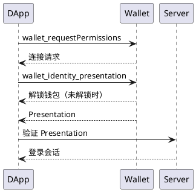
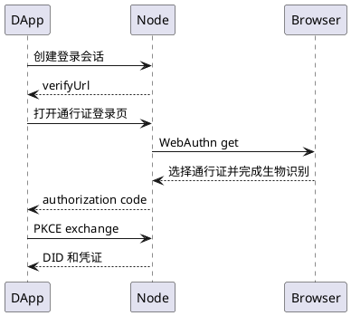

# 钱包身份登录流程

## 插件钱包

1. 后端创建一次性身份登录 session，返回 `audience`、`nonce`、scope 和有效期。
2. 前端调用 `loginWithWalletIdentity`。
3. SDK 请求 `wallet_requestPermissions`；Wallet 只在新增 scope 时显示连接授权页。
4. SDK 请求 `wallet_identity_presentation`；已授权 scope 不重复确认。

5. 后端验证 Presentation 并建立应用会话。

`identity.wallet` 只证明 DID 与身份已绑定地址的关系。Wallet 不得因为当前选中的账户不同而拒绝身份登录；它从当前身份的有效 `WalletAccountCredential` 中生成 `walletProof`。需要证明当前选中地址控制权时，DApp 必须另行使用 `eth_requestAccounts` 或 SIWE。

该流程不自动调用 SIWE 或 `eth_requestAccounts`。需要地址控制权时，应用另行调用 `loginWithSiwe`。

## 无插件

无插件流程使用 Wallet Identity authorization code + PKCE S256。DApp 后端创建 Node 授权请求，用户在 `verifyUrl` 使用 Passkey，应用后端用一次性授权码换取 DID 和凭证结果。该流程由 Node WebAuthn RP 处理，不经过 Wallet Provider。完整接口、页面流转和安全要求见[无插件身份登录接入](./无插件身份登录接入.md)。

两种流程都以 DID 作为应用身份主键，应用不得为插件和无插件流程建立两套用户记录。

## Router/Project 接入要求

需要邮箱资料时，后端 session 必须声明 `identity.email`，并返回身份 issuer 的 `issuerEndpoint`（仅用于 Wallet 本地凭证过期时的受控续签）。Wallet 无法续签、凭证已撤销或缺少有效 `EmailCredential` 时，应用必须提示用户回到 Wallet 完成邮箱验证。

应用接入 Node 身份服务时：

1. 在 Node 应用中心发布应用并配置 `appId` 和 `redirectUris`。
2. 后端创建授权请求，保存 PKCE verifier、state、nonce 和 scope。
3. 插件流程使用 `loginWithWalletIdentity`；无插件流程打开 Node 返回的 `verifyUrl`。
4. exchange 或 verify 后，以 Presentation 返回的 DID 映射本地用户，不使用地址、邮箱或用户名作为身份主键。

身份凭证验证、issuer JWKS 和撤销状态校验由应用后端完成；Router、Project 不应把 Node 登录会话直接当作资源授权令牌。
# 钱包身份登录页面流程

## 钱包插件登录

调用 `loginWithWalletIdentity()` 后，页面顺序固定为：

连接请求页面显示 DApp 实际请求的身份 scope。该流程不显示独立的身份资料授权页，也不显示连接成功页。

## 通行证登录

通行证登录使用 authorization code + PKCE，不经过 EIP-1193 Provider：

通行证登录只显示通行证登录页，以及浏览器/操作系统提供的通行证选择和生物识别界面。
